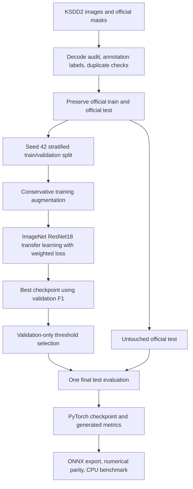
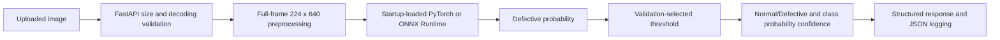

# Training and inference architecture

```mermaid
flowchart TD
    A[KSDD2 images and official masks] --> B[Decode audit, annotation labels, duplicate checks]
    B --> C[Preserve official train and official test]
    C --> D[Seed 42 stratified train/validation split]
    D --> E[Conservative training augmentation]
    E --> F[ImageNet ResNet18 transfer learning with weighted loss]
    F --> G[Best checkpoint using validation F1]
    G --> H[Validation-only threshold selection]
    C --> I[Untouched official test]
    H --> J[One final test evaluation]
    I --> J
    J --> K[PyTorch checkpoint and generated metrics]
    K --> L[ONNX export, numerical parity, CPU benchmark]
```

```mermaid
flowchart LR
    A[Uploaded image] --> B[FastAPI size and decoding validation]
    B --> C[Full-frame 224 x 640 preprocessing]
    C --> D[Startup-loaded PyTorch or ONNX Runtime]
    D --> E[Defective probability]
    E --> F[Validation-selected threshold]
    F --> G[Normal/Defective and class probability confidence]
    G --> H[Structured response and JSON logging]
```

Masks supply binary training labels and post-evaluation review annotations. They are never inference inputs.
